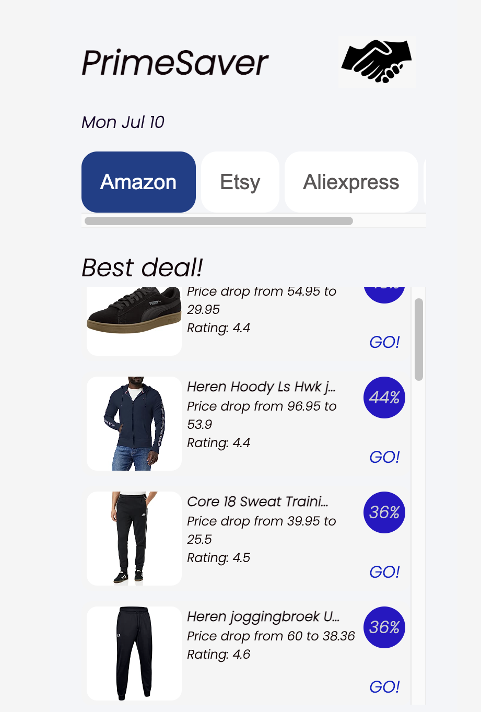

# Amazon Best Deals Scraper (PrimeSaver)

This web scraping application extracts the best deals from Amazon using Oxylabs for web scraping. It provides a user-friendly interface to browse and discover the top deals available on Amazon. The creation of this project has been inspired by [this tutorial on YouTube](https://www.youtube.com/watch?v=2hSC2HaPJDA). Many thanks to Ania! 

## Features

- Scrapes Amazon(NL) for the best deals
- Displays the deals in a user-friendly format
- Allows users to browse and explore the deals
- Integrates with Oxylabs for efficient web scraping

### Demo

## Technologies Used

- React.js: Frontend JavaScript library for building user interfaces
- Node.js: Backend JavaScript runtime environment
- Express.js: Web application framework for Node.js
- Oxylabs: Web scraping service for retrieving data from websites
- CSS: Markup and styling for the user interface

## Getting Started

To get a local copy of the project up and running, follow these steps:

1. Clone the repository: `git clone git@github.com:brigitabi/EcommerceWebscraper.git`
2. Navigate to the project directory: `cd ecommercewebscraper`
3. Install the dependencies: `npm install`
4. Set up your Oxylabs API credentials: Refer to the documentation on how to obtain your Oxylabs API credentials.
5. Configure the Oxylabs API credentials in the backend code.
6. Start the backend server: `npm run start:backend`
7. Navigate to the frontend directory: `npm run start:frontend`
8. Install the frontend dependencies: `npm install`
9. Access the application in your browser at `http://localhost:3000`

## Usage

1. Upon accessing the application, the best deals from Amazon(NL) will be fetched and displayed.
2. Browse the deals, view their details, and click on a deal to visit the Amazon product page.
3. Enjoy exploring the best deals on Amazon!

## Acknowledgments
- Thanks to Oxylabs for providing the web scraping service and to Ania for coming up with a great tutorial!

Happy coding! 🚀

